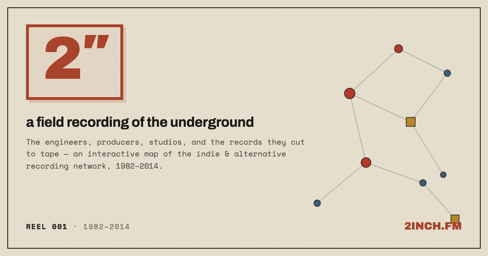

# 2″ — the indie index

**A map of who actually made the records.** The engineers, producers, studios, and the
indie / alternative / post-rock records they cut — as an interactive D3 network, grown by a
"sieve" pipeline that crawls [MusicBrainz](https://musicbrainz.org) and uses an LLM only to
filter noise (never to invent data).

### → Live at **[2inch.fm](https://2inch.fm)**  ·  Method at [2inch.fm/about](https://2inch.fm/about)



Golden-age window **1995–2003** (an admitted bias). **535 nodes** — 170 hand-curated +
365 grown by the sieve — and **695 album credits**, each one traceable to its source.

Click any node to recenter on its web, search a name, trace a six-degrees path between two
artists, play a 30-second preview of any record, and share any view: every URL deep-links
(`?n=` for a node, `?p=` for a path) and unfurls in iMessage/Slack with its own preview card.

---

## How it's built — the cycle of sieves

```
seed engineers → crawl MusicBrainz → ① year window → ② notability (LLM) → ③ dedup
              → merge (provenance-tagged) → LLM nominates more engineers → repeat
```

The LLM is a **filter, not a source**: data comes from the API and is parsed
deterministically; the model only throws out junk and suggests which hubs to crawl next.
Everything it adds is tagged `src:"mb"` and deep-links to the exact MusicBrainz record, so
the curated core and the automated expansion are always separable and verifiable.

📖 **Full write-up:** [`building-sieve-networks.md`](building-sieve-networks.md) — a
domain-agnostic playbook for building one of these about *anything* (papers ↔ co-authors,
films ↔ crew, repos ↔ contributors…).

## Repo layout

| path | what |
|---|---|
| `indie-index/index.html` | the whole front end — D3 v7 force graph, one self-contained file |
| `indie-index/about.html` | the method page (cycle-of-sieves diagram + verbatim prompts) |
| `indie-index/404.html` | the DROPOUT 404 (Cloudflare Pages serves it on missing routes) |
| `indie-index/data.json` | the dataset — `{nodes, links}`, provenance-tagged |
| `functions/` | Cloudflare Pages Functions (edge): dynamic Open Graph share previews per link |
| `pipeline/` | the resumable Python crawler (stdlib + local `claude` binary) |
| `pipeline/README.md` | how to run a crawl round |
| `building-sieve-networks.md` | the methodology + D3 playbook (domain-agnostic) |
| `AGENTS.md` | guide for agents (and humans) working in this repo |
| `music_api_research.md` | early comparison of MusicBrainz vs Discogs |
| `package.json` | deps for the Functions only (`workers-og`); the app + pipeline have none |
| `deploy.sh` | one-command Cloudflare Pages deploy |

## The data

`indie-index/data.json` is the served dataset. Nodes are people / bands / studios; links are
album credits. Provenance:

- Crawl-added entries carry **`src:"mb"`**; the hand-curated core has no tag.
- Each crawl **edge** stores the MusicBrainz **release id**; each **node** stores its
  **artist id** — so the UI deep-links every fact to its source.

Credit data is from **MusicBrainz** (CC0). Album art and 30-second audio previews are
fetched live from the iTunes Search API (not stored).

## Hosting & cost

On **Cloudflare Pages**. Static hosting (the site + data + images) is free and unlimited.
The dynamic share-preview cards run as **Pages Functions** (`functions/`, using `workers-og`),
which sit inside the **free Workers tier (100k requests/day)** at this scale — and on the free
plan, exceeding that throttles requests rather than billing you, so there's no surprise charge.
No build step for the app or pipeline; only the Functions pull a dependency.

## Run it

```bash
# the site (static — any server works)
cd indie-index && python3 -m http.server 8742      # → http://localhost:8742

# a crawl round (see pipeline/README.md for the full workflow)
python3 -m pipeline --model sonnet --year-min 1995 --year-max 2003 --grow 25

# deploy (Cloudflare Pages; reads a scoped token from ~/.cf_2inch_token)
bash deploy.sh
```

Requires Python 3 (stdlib only) and, for the pipeline, the local `claude` CLI.

---

*Built with [D3](https://d3js.org). Data from MusicBrainz. The boundaries are arbitrary and
that's the point — see the [method page](https://2inch.fm/about).*
